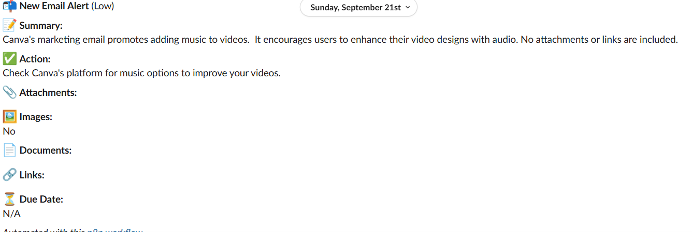
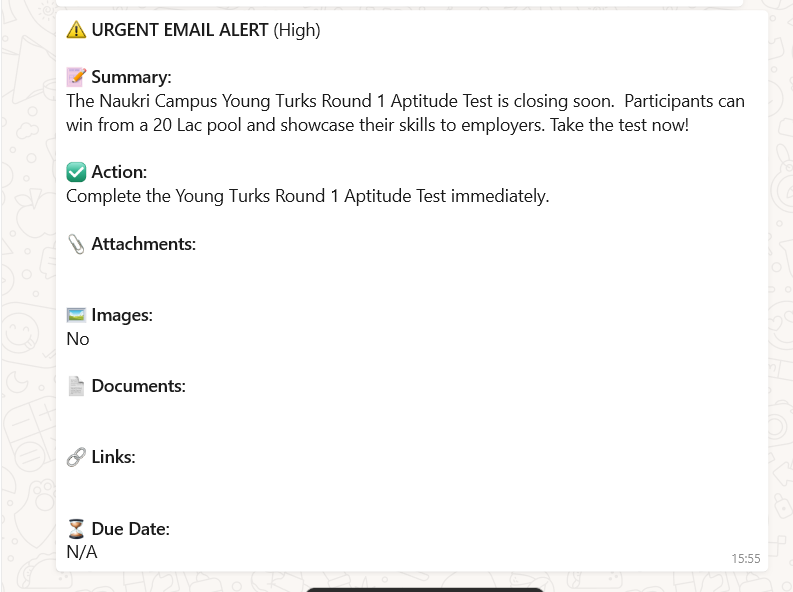

# 📧 n8n Gmail–Gemini–Slack/WhatsApp Alert Workflow

Automate the process of managing incoming emails and ensure critical messages are never missed with n8n, a powerful low-code workflow automation tool. This workflow continuously monitors a Gmail inbox for new messages, intelligently parses their content, and summarizes them using Google Gemini, a cutting-edge AI language model.

The system identifies key elements of each email, such as:

Subject and sender information

Main message content

Attachments (images, PDFs, DOC/DOCX files)

Embedded links

High-priority phrases or deadlines

Based on the analysis, it categorizes emails by urgency and generates actionable insights. High-priority emails trigger real-time alerts via WhatsApp/SMS using Twilio, ensuring that urgent matters reach the user immediately on mobile devices. All emails, regardless of urgency, are also posted to a Slack channel, providing a structured and accessible team-wide notification system.

This combination of AI-powered summarization, intelligent routing, and cross-platform alerts transforms email management from a reactive task into a proactive workflow, saving time, reducing missed deadlines, and improving overall communication efficiency.
---

## ✨ Key Features
- **Real-time Gmail Monitoring** – Polls your Gmail inbox every minute.
- **AI-Powered Summarization** – Google Gemini (1.5 Flash) extracts concise summaries, recommended actions, urgency, keywords, links, and deadlines.
- **Smart Notifications** – High-urgency emails trigger WhatsApp/SMS alerts; all emails post to a Slack channel.
- **Attachment & Link Parsing** – Detects images, documents (PDF/DOCX/TXT), and URLs.

---

## 🛠️ Why These Tools?

| Tool / Service | Purpose | Reason for Choice |
|---------------|--------|------------------|
| **n8n** | Low-code automation platform | Self-hostable, flexible, supports custom code and rich integrations. |
| **Gmail API** | Email source | Reliable, easy to poll and filter labels. |
| **Google Gemini** | AI summarization | Fast, cost-efficient LLM with high-quality text summarization. |
| **Slack** | Team notifications | Ideal for structured team alerts and archives. |
| **Twilio WhatsApp/SMS** | Mobile urgent alerts | Global reach, quick WhatsApp integration for real-time delivery. |

---

## 📸 Screenshots

### Slack Alert Example
This screenshot shows how a new email is posted in Slack. The message includes the AI-generated summary, recommended action, urgency level, attachments, images, documents, links, and due date.



### WhatsApp High-Urgency Alert
This screenshot demonstrates a high-urgency email notification sent via WhatsApp. It mirrors the Slack alert content but is sent directly to mobile, ensuring immediate attention for critical emails.




---
## 🎥 Project Demo

Watch a detailed walkthrough of the workflow in action:

[▶ Project Demo Video](InboxInsight.mp4)  
## 🗂 Project Structure
```

n8n-email-alert-workflow/
├── email-alert-workflow.json   # Importable n8n workflow
├── images/
│   ├── slack-alert.png         # Slack screenshot
│   └── whatsapp-alert.jpg      # WhatsApp screenshot
└── README.md

````

---

## 🚀 Quick Start

### 1. Prerequisites
- [n8n](https://n8n.io/) instance (self-hosted or cloud)
- Gmail account with API access
- Google Gemini API key
- Twilio account (WhatsApp/SMS)
- Slack workspace & bot token
- Git & terminal access

### 2. Clone Repository
```bash
git clone https://github.com/<akshat0504-05>/n8n-email-alert-workflow.git
cd n8n-email-alert-workflow
````

### 3. Import the Workflow

1. Open n8n editor.
2. **Settings → Import from File** → select `email-alert-workflow.json`.
3. Configure credentials (below) and activate.

---

## 🔑 Credentials in n8n

| Service | Node          | Required Keys/Tokens      |
| ------- | ------------- | ------------------------- |
| Gmail   | Gmail Trigger | OAuth2 client ID & secret |
| Gemini  | HTTP Request  | API key                   |
| Twilio  | Twilio        | Account SID & Auth Token  |
| Slack   | Slack         | Bot OAuth Token           |

⚠️ **Never commit real API keys** to GitHub. Use n8n’s encrypted credentials.

---

## 🧩 Workflow Steps

| Step | Node                       | Purpose                                                         |
| ---- | -------------------------- | --------------------------------------------------------------- |
| 1    | **Gmail Trigger**          | Polls Gmail inbox every minute                                  |
| 2    | **Content (Code)**         | Cleans body text, detects urgency, collects attachments & links |
| 3    | **HTTP Request**           | Sends cleaned content to Gemini for summarization               |
| 4    | **Parse the Model (Code)** | Parses Gemini’s JSON output                                     |
| 5    | **Switch**                 | Routes messages based on urgency                                |
| 6    | **Twilio**                 | Sends WhatsApp/SMS if urgency is High                           |
| 7    | **Slack**                  | Posts formatted message to a Slack channel                      |

---

## 🧪 Testing

1. Send a test email with “URGENT” in the subject.
2. Slack should receive a formatted alert.
3. If urgency is **High**, a WhatsApp/SMS message is sent.

---

## 🤝 Contributing

Pull requests welcome:

```bash
git checkout -b feature/my-improvement
git commit -m "Add my improvement"
git push origin feature/my-improvement
```

---

## 📄 License

MIT License.

---

## 💡 Future Enhancements

* Support for Microsoft Outlook or other mail providers.
* Store summaries in a database for analytics.
* Add sentiment analysis of email content.

---

## 👤 Maintainer

**Akshat Sharma**
[akshat0504-05](https://github.com/akshat0504-05)


